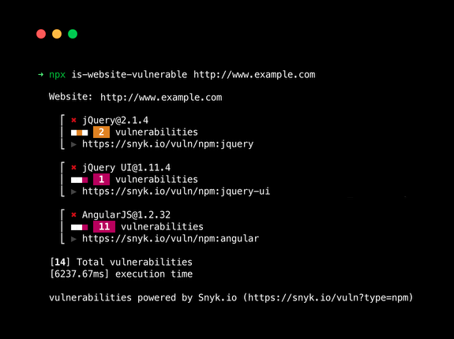

<p align="center"><h1 align="center">
  is-website-vulnerable
</h1>

<p align="center">
  finds publicly known security vulnerabilities in a website's frontend JavaScript libraries
</p>

<p align="center">
  <a href="https://www.npmjs.org/package/is-website-vulnerable"></a>
  <a href="https://www.npmjs.org/package/is-website-vulnerable"></a>
  <a href="https://www.npmjs.org/package/is-website-vulnerable"></a>
  <a href="https://github.com/lirantal/is-website-vulnerable/actions?workflow=CI"></a>
  <a href="https://codecov.io/gh/lirantal/is-website-vulnerable"></a>
  <a href="https://snyk.io/test/github/lirantal/is-website-vulnerable"></a>
  <a href="./SECURITY.md"></a>
</p>

<p align="center">
  
  <p align="center">
  	<p align="center">Many thanks to <a href="https://snyk.io"></a> for supporting open source security</p>
</p>


</p>


# About

Finds publicly known security vulnerabilities in a website's frontend JavaScript libraries.

# Usage

## Command line

Using Node.js's `npx` to run a one-off scan of a website:

```bash
npx is-website-vulnerable https://example.com [--json] [--js-lib] [--mobile|--desktop] [--chromePath] [--cookie] [--token]
```

The CLI will gracefully handle cases where the URL to scan is missing by prompting you to enter it:

```bash
$ npx is-website-vulnerable
Woops! You forgot to provide a URL of a website to scan.
? Please provide a URL to scan: › https://example.com
...
```

## Docker

To build and run the container locally:

```bash
# Clone Repo:
git clone https://github.com/lirantal/is-website-vulnerable.git

# Change to repo's cloned directory:
cd is-website-vulnerable

# Build Image locally:
docker build --no-cache -t lirantal/is-website-vulnerable:latest .

# Run container:
docker run --rm -e SCAN_URL="https://www.google.com/" lirantal/is-website-vulnerable:latest
```

`SCAN_URL` is an environment variable and its value must be replaced with the desired URL during Docker run. Docker container will exit once the scan has been completed.

:warning: A modern version of Chrome is assumed to be available when using `is-website-vulnerable`. It may not be safe to assume that this is satisfied automatically on some CI services. For example, [additional configuration](https://docs.travis-ci.com/user/chrome#selecting-a-chrome-version) is necessary for [Travis CI](https://travis-ci.com/).

# Github Action
Create .github/workflows/is-website-vulnerable.yml with the url that you want scanned:

```
name: Test site for publicly known js vulnerabilities

on: push
jobs:
  security:
    runs-on: ubuntu-latest
    steps:
      - name: Test for public javascript library vulnerabilities 
        uses: lirantal/is-website-vulnerable@master
        with:
          scan-url: "https://yoursite.com"
```

# Install

You can install globally via:

```bash
npm install -g is-website-vulnerable
```

# Contributing

Please consult [CONTRIBUTING](./CONTRIBUTING.md) for guidelines on contributing to this project.

# Author

**is-website-vulnerable** © [Liran Tal](https://github.com/lirantal), Released under the [Apache-2.0](./LICENSE) License.
